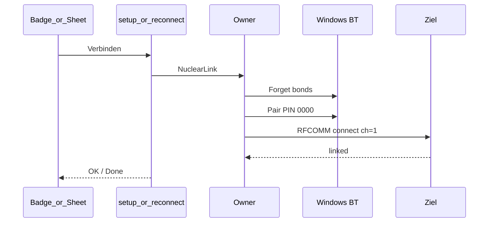

# Bluetooth-Connection-Stack (RedDot Arena)

Ausführliche Beschreibung des **kompletten** Bluetooth-/RFCOMM-Stacks der Desktop-App (Stand: Branch `feat/rfcomm-bond-gate`).

Verwandte Kurzdocs:

- [`transport.md`](./transport.md) — Adapter-Übersicht & Feature-Flags
- [`adr/0001-native-rfcomm.md`](./adr/0001-native-rfcomm.md) — Warum Winsock RFCOMM statt Virtual COM
- [`protocol.md`](./protocol.md) — ENQ/NAK/STX/ACK Byte-Protokoll
- [`rfcomm-nuclear-test-matrix.md`](./rfcomm-nuclear-test-matrix.md) — Lab-Matrix Nuclear + Bond-Gate
- [`rfcomm-hardware-acceptance.md`](./rfcomm-hardware-acceptance.md) — Hardware-Abnahmematrix
- [`einfach-genial.md`](./einfach-genial.md) — Evidenz, Grenzen, Abnahme (Merge-Gate)

---

## 1. Zielbild in einem Satz

**Startup Nuclear:** Known BD_ADDR → genau ein Full-Nuclear-Lauf (Forget → Pair PIN `0000` → RFCOMM).
**Badge / Setup Verbinden → Nuclear** (gleicher Repair; Badge/Setup darf auch name-hint Bonds mitvergessen).
**Kein Soft-Wake, kein Soft-A/B-Start, kein Auto-Nuclear nach Link Lost.** Fail → Idle; erneuter Lauf nur über Badge.

Hardware: KT RDT / BT Classic 2.0 SPP (Kanal 1); Identität = persistierte BD_ADDR.

| Pfad | Wann | Forget / Pair? |
|---|---|---|
| **Startup Nuclear** | App-Start + Known BD_ADDR (genau 1×) | ja — **nur** persistierte BD_ADDR → Pair → RFCOMM |
| **Nuclear (Badge/Setup)** | Verbinden / Setup | ja — primary + name-hint RedDots → Pair → RFCOMM |
| **Idle** | Nuclear-Fail, Link lost, Abbruch | wartet auf User-Nuclear (Badge) |
| **Setup-Sheet** | kein Known (`needsTarget`) **oder** explizit (Badge / Settings „Anderes Gerät verbinden“) | Scan (alle RedDots, Liste) → Tap → Nuclear-Connect (Target-Switch) |
| **Forget** | Nutzer | Bond + JSON weg |

Bond-Lookup am Start ist **Diagnose** (JSONL `startup_bond_diag`), keine Freigabe für reines RFCOMM (Soft-A).

### Startup Nuclear

**Startup Nuclear ist eine hardware-spezifische Ausnahme:** Für ein validiertes Known Target wird beim App-Start einmal `Forget(PrimaryOnly)` → `Pair(PIN 0000)` → RFCOMM ausgeführt, weil dies im Lab der einzige toast-freie, zuverlässige Startpfad ist. Der Vorgang wird weder wiederholt noch nach Link Loss automatisch ausgelöst — kein allgemeines Bluetooth-Reconnect-Muster, sondern ein bewusst enger Vertrag für diese Legacy-Hardware.

Für ein persistiertes RedDot-Ziel führt die App beim Start genau einen kontrollierten Repair-Lauf aus: Forget → Pair PIN `0000` (Hook) → RFCOMM.

**Begründung:** Bei bestehendem Bond ist `pair_with_pin` oft ein No-op; reines RFCOMM kann beim schlafenden Ziel fehlschlagen oder Windows-UI auslösen. Full Nuclear war im Lab der gemessene toast-freie, erfolgreiche Startpfad (`bt_start_pair_variants` N).

**Grenze:** Kein Retry, kein Release-als-Startpfad, kein Soft-Wake und kein Auto-Nuclear nach Link Lost. Bei Fail: Idle; erneuter Nuclear nur über Badge. Nie per Namen suchen oder fremde Geräte unprompted forgetten — nur die persistierte BD_ADDR.

**Produktregel:** „Verbinden“ (Badge/Setup) bleibt derselbe deterministische Repair. Start erweitert „explizit“ auf „explizit konfiguriertes Known Target“ — einmalig, single-flight, dokumentiert, nicht rekursiv.

**UI-Vertrag:** Linked = „Verbunden“; Idle+Known = „Nicht verbunden“ / Aktion „Verbindung reparieren“ (Nuclear); NeedsTarget = „Gerät einrichten“; Connecting zeigt Phasen („Gerät wird vorbereitet…“ → „Kopple RedDot…“ → „Verbinde…“) und ist abbrechbar. Diagnose: Rechtsklick Badge → letzte JSONL-Ereignisse (`startup_nuclear`).

Lab: [`rfcomm-nuclear-test-matrix.md`](./rfcomm-nuclear-test-matrix.md) (N1–N10 + Startup-Soak).

---

## 2. Architektur-Überblick

```text
┌─────────────────────────────────────────────────────────────────┐
│  Frontend (React / Tauri invoke)                                 │
│  RedDotSetupSheet · LiveLinkBadge · useLiveLinkStatus · live.ts  │
└───────────────────────────────┬─────────────────────────────────┘
                                │ Tauri commands
                                │ rfcomm_status / setup_scan /
                                │ setup_connect / forget / reconnect
┌───────────────────────────────▼─────────────────────────────────┐
│  ConnectionHandle  (mpsc → Owner, SharedState Mutex)              │
└───────────────────────────────┬─────────────────────────────────┘
                                │ Thread „rfcomm-connection“
┌───────────────────────────────▼─────────────────────────────────┐
│  Connection Manager (Owner)                                      │
│  Startup Nuclear · Badge Nuclear · ENQ keepalive · Sink-Fanout   │
└───────────────────────────────┬─────────────────────────────────┘
                                │ ByteTransport
┌───────────────────────────────▼─────────────────────────────────┐
│  transport/rfcomm/                                               │
│  WinsockRuntime · RfcommSocket · discovery · auth_hook · sdp     │
└───────────────────────────────┬─────────────────────────────────┘
                                │ AF_BTH / BTHPROTO_RFCOMM
┌───────────────────────────────▼─────────────────────────────────┐
│  Windows Bluetooth Stack  ↔  RedDot Ziel (SPP ch=1, PIN 0000)    │
└─────────────────────────────────────────────────────────────────┘

Parallel (nur bei aktiver Live-Session):

  StandEngine poll loop
       │
       ▼
  RfcommBridgeTransport::open()  →  RegisterSink
       │
       ▼
  raw bytes → Protocol Parser → SQLite / Arena UI
```

### Design-Prinzipien

| Prinzip | Bedeutung |
|---|---|
| **Owner-Thread** | Genau ein Thread besitzt den Socket; keine parallelen Connect-Loops |
| **Generation** | Jeder Abbruch/Target-Wechsel bumpt `generation` → veraltete Connects werden verworfen |
| **Startup Nuclear einmal** | Known BD_ADDR → 1× Full Nuclear; Fail → Idle; kein Auto-Retry |
| **Nur Known-BD_ADDR am Start** | Kein Name-Scan, kein Forget fremder Geräte beim Start |
| **Verbinden = Nuclear** | Badge / Setup: Forget → Pair → RFCOMM (`nuclear.rs`) |
| **BD_ADDR ist Identität** | Persistiert in `rfcomm_devices.json`, nicht Anzeigename/COM-Port |
| **Kein Known → Setup** | `needsTarget` öffnet Sheet |
| **Hook wo Pairing nötig** | Nuclear (Startup + Badge/Setup); kein Dauer-Soft-Wake |
| **Linked = Socket-OK** | ENQ ist Keepalive danach, keine Verify-Phase |
| **Session ≠ Link** | Session-Stop = `UnregisterSink`; Link + ENQ laufen weiter |
| **Link lost → Idle** | Kein Auto-Nuclear; User tippt Verbinden |
| **Kein SDP beim Connect** | Bekannter Kanal `1`; SDP/Flush kann Re-Pair-UI triggern |

---

## 3. Modul-Landkarte (Dateien)

### Backend — Connection

| Datei | Rolle |
|---|---|
| `connection/mod.rs` | Öffentliche Exports |
| `connection/manager.rs` | Fassade: spawn `ConnectionManager`, Re-Exports |
| `connection/handle.rs` | `ConnectionHandle` |
| `connection/shared.rs` | SharedStatus hinter dem Handle |
| `connection/owner.rs` | Owner-Loop: Startup Nuclear + Badge/Setup Nuclear + Commands |
| `connection/nuclear.rs` | Forget → Pair → RFCOMM (`ForgetScope`: PrimaryOnly | AllRedDotHints) |
| `connection/keepalive.rs` | ENQ / Read / Sink-Fanout; Link lost → Idle |
| `connection/setup_flow.rs` | First-Setup Scan + Nuclear-Connect |
| `connection/bridge.rs` | Session-`RfcommBridgeTransport` |
| `connection/connect_policy.rs` | BondLookup / ConnectPhase / fail taxonomy (Soft-Wake tables = tests) |
| `connection/timing.rs` | Timeouts / ENQ-Intervalle |
| `connection/command.rs` | `ConnectionCommand`-Enum |
| `connection/status.rs` | `ConnectionStatus` |
| `connection/event.rs` | Optionale Events |
| `connection/persist.rs` | `rfcomm_devices.json` |
| `connection/backoff.rs` | Reconnect-Delays |
| `connection/diag.rs` | JSONL-Diagnose |
| `connection/generation_tests.rs` | Unit-Tests Generation / Policy |

### Backend — RFCOMM Transport

| Datei | Rolle |
|---|---|
| `transport/rfcomm/mod.rs` | Modul + Trait `ByteTransport` |
| `transport/rfcomm/runtime.rs` | `WSAStartup` / `WinsockRuntime` |
| `transport/rfcomm/socket.rs` | `RfcommSocket::connect` (Kanal 1, select-Timeout) |
| `transport/rfcomm/ffi.rs` | Winsock/BTH FFI-Typen |
| `transport/rfcomm/discovery.rs` | Paired-Enumeration, Inquiry, `pair_with_pin`, `bond_state` |
| `transport/rfcomm/auth_hook.rs` | `BluetoothRegisterForAuthentication` → PIN `0000` |
| `transport/rfcomm/sdp.rs` | Optionale SPP-Kanal-Auflösung (nicht im Happy-Path-Connect) |
| `transport/rfcomm/target.rs` | `RfcommTarget`, `SPP_SERVICE_UUID` |
| `transport/rfcomm/error.rs` | `TransportError` inkl. Winsock-Codes |

### Backend — Verdrahtung

| Datei | Rolle |
|---|---|
| `lib.rs` | Startet `ConnectionManager`, managed `ConnectionHandle`, registriert Commands |
| `commands/live.rs` | Tauri-Commands `rfcomm_*` |
| `engine/poll/connect.rs` | Session öffnet `RfcommBridgeTransport` (nur Sink) |
| `protocol.rs` | ENQ/ACK/NAK/STX-Parser (transportunabhängig) |
| `transport/serial_link.rs` | Legacy Virtual-COM (Feature `serial`, nicht Default) |
| `bin/bt_diag.rs` / `bin/bt_soak.rs` | Diagnose-/Soak-Tools (`--features rfcomm`) |

### Frontend

| Datei | Rolle |
|---|---|
| `api/live.ts` | `rfcommStatus`, `rfcommSetupScan`, `rfcommSetupConnect`, … |
| `hooks/useLiveLinkStatus.ts` | 1 Hz Poll → Badge + `needsSetup` |
| `components/LiveLinkBadge.tsx` | Grün/Gelb/Rot je nach Link |
| `components/RedDotSetupSheet.tsx` | First-Setup: Suche → Verbinden → fertig |
| `views/LiveStandView.tsx` | Öffnet Sheet wenn `needsSetup` |
| `views/live/LiveSessionControls.tsx` | Session-UI (kein Connect-Button im Happy Path) |

---

## 4. Feature-Flags & Build

`apps/desktop/src-tauri/Cargo.toml`:

```toml
default = ["simulator", "rfcomm"]
simulator = []
serial = ["dep:serialport"]   # Legacy COM — optional
rfcomm = []                   # Produkt-Bluetooth-Pfad
```

| Build | Effekt |
|---|---|
| Default `cargo build` | Simulator + RFCOMM |
| `--features serial --no-default-features --features simulator,serial` | Alter COM-Pfad |
| `bt_diag` / `bt_soak` | Brauchen Feature `rfcomm` |

**Nicht verwendet (bewusst):** WinRT `Windows.Devices.Bluetooth.Rfcomm`, BthModem/Virtual COM als Normalpfad, Radio-Toggle, `IOCTL_BTH_DISCONNECT` als Recovery.

---

## 5. Lebenszyklus der App

### 5.1 Start (`lib.rs`)

1. App-Datenverzeichnis ermitteln.
2. `ConnectionManager::start(data_dir, …)`:
   - `WinsockRuntime::init()`
   - **kein** globaler Dauer-PIN-Hook (Hook nur während Nuclear)
   - Owner-Thread `rfcomm-connection` spawnen
   - Known-Target aus `rfcomm_devices.json` laden
   - `ConnectionCommand::Start` senden → Startup Nuclear **oder** NeedsTarget
3. `ConnectionHandle` als Tauri-State registrieren.
4. Bei Window-Close / Exit: `Shutdown` → Socket schließen / Hook deregistrieren.

### 5.2 `Start`-Logik (Owner)

```text
Known Target (persistierte BD_ADDR)?
  ├─ Nein → NeedsTarget  (Setup-Sheet; kein Forget, kein Name-Scan)
  └─ Ja  → genau 1× Startup Nuclear (ForgetScope::PrimaryOnly)
            Forget → Hook → Pair PIN 0000 → RFCOMM
            ├─ Erfolg → Linked
            └─ Fail / Abbruch → Idle  (Badge kann erneut Nuclear)
```

Kein zweiter Nuclear-Lauf ohne User. Kein Soft-A/B, kein Auto-Nuclear nach Link Lost.
Bond-Lookup nur als Diag (`startup_bond_diag`), nicht als Soft-Freigabe.

### 5.3 Runtime nach Nuclear

Owner in `Linked` → `pump_linked()` (ENQ + Read). Link lost → `Idle` („tippe Verbinden“).

UI: Badge grün wenn Linked; sonst **Verbinden** (Nuclear) oder **Einrichten** (`needsSetup`).

### 5.4 First Setup (kein Known)

`needs_setup()` → `RedDotSetupSheet`:

1. `rfcomm_setup_scan` → Pause + Scan
2. User **Verbinden** → Nuclear (`setup_connect` / `NuclearLink`)
3. Linked → Known gespeichert

Details: Abschnitt 8.
---

## 6. ConnectionStatus

Enum in `connection/status.rs` (Frontend-Strings camelCase):

| Status | Bedeutung |
|---|---|
| `idle` | Bereit / nach Startup-Nuclear-Fail / nach Link lost — warte auf Verbinden |
| `needsTarget` | Keine BD_ADDR bekannt / vergessen |
| `discovering` | Setup-Scan / PauseForSetup |
| `connecting` | Soft- oder Nuclear-Versuch |
| `linked` | Socket offen, ENQ läuft |
| `reconnecting` | Legacy / selten — Produktpfad nutzt Idle statt Soft-Wake-Loop |
| `needsPairing` | Nuclear/Auth-Fehler — **kein** Connect-Spam |
| `faulted` | Persist-/schwerer Fehler (s. Recovery unten) |
| `shuttingDown` | App beendet |

**Recovery aus `faulted`:** Der Status ist **nicht** terminal für die App, aber der Owner startet von dort **keinen** automatischen Connect-Loop. Typische Ursachen: `save_known_target` fehlgeschlagen (I/O), oder ein seltener Discover-Fehler beim `Start`.

| Aktion | Wirkung |
|---|---|
| `ForgetTarget` | Löscht Known-Target → `needsTarget` → First-Setup-Sheet |
| `SelectTarget` / erfolgreiches `setup_connect` | Neues Target; Setup endet oft bereits Linked (Nuclear) |
| `ReconnectNow` / Badge Verbinden | **Nuclear** auf Known-Target |
| App-Neustart | Soft wenn Bond OK, sonst Idle / NeedsTarget |

Es gibt **keinen** dedizierten „Clear Fault“-Command. UI sollte bei anhaltendem `faulted` `reason` anzeigen und Setup/Forget anbieten — nicht nur „searching“ vortäuschen.

Frontend-Mapping (`useLiveLinkStatus`):

- `linked` → UI `connected`
- `connecting` / `reconnecting` / `discovering` → `searching`
- `needsPairing` / `needsTarget` / `faulted` / Rest → `disconnected`

**Badge:** `connecting` / `discovering` → UI `searching` („Verbinde…“). Nach Soft-Fail oder Link lost: `idle` + Label **Verbinden** (Nuclear). Kein Soft-Wake-Dauerloop.

---

## 7. Commands (Owner-Thread)

`ConnectionCommand` in `connection/command.rs`:

| Command | Wirkung |
|---|---|
| `Start` / `ConnectKnown` | Known vorhanden → 1× Startup Nuclear; sonst NeedsTarget |
| `SelectTarget(t)` | Speichern → Idle „Verbinden“ (kein Auto-Nuclear; Setup nutzt danach oft Nuclear) |
| `NuclearLink { addr, name, origin }` | Forget → Pair → RFCOMM (blocking auf Owner; Startup = PrimaryOnly) |
| `ForgetTarget` | Bond + JSON weg → `NeedsTarget` |
| `PauseForSetup` | Generation++, Socket weg (`Discovering`) |
| `RegisterSink` / `UnregisterSink` | Session Bytes an/ab |
| `WriteBytes` | Session-Writes (ACK etc.); ENQ schreibt der Owner selbst |
| `ReconnectNow` | Nuclear auf Known-Target (Badge Verbinden) |
| `SystemResume` / `DeviceChanged` | derzeit No-Op (kein Auto-Reconnect-Loop) |
| `Shutdown` | Thread beenden |

---

## 8. First-Setup-Flow (Detail)

### 8.1 UI — `RedDotSetupSheet`

Zustände: `idle` → `searching` → `found` → `connecting` → `done` | `error`.

- Öffnen → Scan.
- **Verbinden** → `rfcommSetupConnect` → Owner **Nuclear** (bis Linked oder Fehler).
- Fehler: erneut Verbinden / erneut suchen.
- PIN `0000` (Hook / Pair); Toast möglichst nicht tippen.

### 8.2 `setup_scan`

1. `PauseForSetup`.
2. `scan_all_reddots()` — **immer beide Quellen**: `enumerate_paired()` + Nearby-Inquiry, per BD_ADDR dedupliziert, Name-Hint-Filter. Kein paired-first-Shortcut mehr — ein zweites/neues RedDot bleibt sichtbar, auch wenn ein altes noch gebondet ist.
3. `Vec<SetupCandidate { btAddrHex, displayName, alreadyPaired, isActive }>` — aktives (persistiertes) Gerät zuerst, sonst Discovery-Rank (Hint → paired → Name).
4. UI: genau 1 Treffer = große CTA (wie früher); mehrere = tappbare Liste.

### 8.3 `setup_connect` (= Target-Switch)

Kein Re-Inquiry (UI-Freeze). Display-Name vom Scan/Hint.

```text
PauseForSetup
NuclearLink(addr, display_name)   → [Switch: alter Known-Bond explizit weg] → forget → pair → RFCOMM
poll bis Linked (max ~90s) oder Faulted/NeedsPairing/NeedsTarget
```

Gleiche Semantik wie Badge **Verbinden** (`connect_known_nuclear`). Ist die gewählte Adresse ≠ bisheriges Known, entfernt der Owner **zusätzlich explizit** den alten Bond (`switch_forget_addr` in `owner.rs`) — `AllRedDotHints` deckt nur name-hint Bonds und könnte ein umbenanntes Altgerät verpassen. Damit ist Gerätewechsel ohne manuelles „Gerät vergessen“ möglich.

### 8.4 Einstiege

| Einstieg | Pfad |
|---|---|
| Setup-Sheet Verbinden | `setup_connect` → Nuclear (`AllRedDotHints`) |
| Badge Verbinden (Known) | `connect_known_nuclear` → Nuclear |
| Kaltstart + Known | Startup Nuclear einmal (`PrimaryOnly`) → Linked \| Idle |
| Kaltstart ohne Known | NeedsTarget → Setup |
| Link lost / Nuclear-Fail | Idle → User Nuclear (Badge) |

---

## 9. Pairing, Auth-Hook, Bond-Gates

### 9.1 PIN

`REDDOT_PAIR_PIN = "0000"`.

### 9.2 Auth-Hook (`auth_hook.rs`)

- Installiert **während Soft und Nuclear**, nicht dauerhaft am Manager-Start.
- Callback: PIN `0000` / Numeric Comparison, gefiltert nach Name-Hint oder `allow_auto_pin_for`.
- Win11: Authentication**Ex** (+ Legacy); sonst oft buggy PIN-Dialog.
- `send_rc=0` → PIN schon beantwortet — Dialog nicht tippen.
- Toast kann kurz aufblitzen.

### 9.3 Pair innerhalb Nuclear

`run_nuclear_link`: Forget → settle → Pair (Hook/RAII um Pair+RFCOMM) → RFCOMM-Retries. Details: `connection/nuclear.rs`.

### 9.4 Bond-Gate (kritisch)

```text
BondLookup::Bonded  → Soft auf Start erlaubt
sonst               → Soft überspringen (Idle oder Nuclear auf User-Geste)
```

Soft+Hook **ohne** Bond kann physisch linken (Pair-on-Connect) → Gate entscheidet *vorher*, Soft nicht „ausprobieren“.

Unauthentifiziertes RFCOMM ohne gesteuerte Pairing-Sequenz → buggy Windows-PIN-UI — vermeiden.

---

## 10. Discovery

### 10.1 Name-Hints

Priorität (niedriger Index = besser): `KT RDT` > `RDT` > `REDDOT` > `DISAG`.

### 10.2 Quellen (`enumerate_paired_detailed`)

Merged aus:

1. Winsock `WSALookupService*` (NS_BTH)
2. `BluetoothFindFirstDevice` / Next (Flags: remembered, authenticated, …)
3. SetupAPI `BTHENUM\DEV_<12 hex>` (nur Adresse)

### 10.3 Nearby Inquiry

`find_nearby_reddot` / `inquire_reddot_candidate` — aktive Suche für ungepaarte, sichtbare Geräte. Nur im **Scan**, nicht im Connect.

### 10.4 SPP / Kanal (Hartcode `1` + Diagnose-Fallback)

- UUID: `00001101-0000-1000-8000-00805F9B34FB`
- Produktpfad: **Kanal fest `1`** (kein SDP beim Connect — SDP/`LUP_FLUSHCACHE` kann Re-Pair-UI triggern)

**Silent assumption:** Alle bekannten KT-RDT / Disag-RedDot-Ziele sprechen SPP auf RFCOMM-Kanal **1**. Weicht eine Hardware-Revision ab, schlägt Connect fehl (typisch Timeout / `WSAECONNREFUSED` / `ADDRINUSE`-Schleife ohne jemals `linked`) — **ohne** dass die App den „richtigen“ Kanal sucht.

| Wenn Kanal 1 nicht stimmt | Was tun |
|---|---|
| Fehlerbild | Soft/Nuclear failen; Idle oder NeedsPairing; JSONL Soft/Nuclear-Fails |
| Einmalige Diagnose | `resolve_spp_channel(bt_addr)` in `sdp.rs` (ohne Cache-Flush) per `bt_diag` |
| Produkt-Fix | Kanal in `rfcomm_devices.json` unter `rfcommChannel` persistieren; SDP **nicht** im Soft/Nuclear-Loop |
| Nicht tun | SDP bei jedem Connect; `LUP_FLUSHCACHE`; Multi-Port-Hammering (1…30) |

`sdp.rs` ist bewusst Diagnose-/Sonderpfad, nicht Happy-Path.

---

## 11. RFCOMM-Socket & Connect-Policy

### 11.1 Connect (`socket.rs`)

- `socket(AF_BTH, SOCK_STREAM, BTHPROTO_RFCOMM)`
- `SOCKADDR_BTH` mit BD_ADDR + Port (= Kanal)
- Non-blocking + `select` bis Timeout
- Fehler über `SO_ERROR` / Winsock-Codes

Policy-Kommentare im Code:

- Nie SDP während Connect wenn Kanal bekannt
- Kein Multi-Port-Hammering
- Soft: begrenzte Retries im Owner; Nuclear: Retries in `nuclear.rs`

### 11.2 Startup Nuclear + Badge Nuclear (Produkt)

Siehe Abschnitt 1 — **Startup Nuclear** und Grenzen (kein Retry, kein Auto-Nuclear nach Link Lost).

**Startup Nuclear (Owner `Start`, nur Known BD_ADDR):** `ForgetScope::PrimaryOnly` → Pair PIN `0000` → RFCOMM. Erfolg → Linked. Fail → Idle. Origin API: `startupNuclear`. Diag: `startup_nuclear`.

**Nuclear Badge/Setup (`NuclearLink` / `ReconnectNow` / Setup Verbinden):** `ForgetScope::AllRedDotHints` → Pair → RFCOMM. Fail → NeedsPairing. Lab: `bt_reset_connect` / `bt_start_pair_variants` N.

**Bond-Lookup:** Diagnose am Start (`startup_bond_diag`); entscheidet nicht mehr über Soft-A. Soft-Wake-Dauerloop entfernt. Disposition-Tabellen in `connect_policy` nur noch für Unit-Tests. Siehe [`einfach-genial.md`](./einfach-genial.md).

Forget User: Bond entfernen + JSON. Nuclear Forget ist Teil von Start/Verbinden.

`rfcomm_status.connectPhase` / `connectOrigin`: Diag. UI-Alltag: Linked vs Idle vs Connecting.

### 11.3 Typische Winsock-Fehler

| Code | Name | Bedeutung / Reaktion |
|---|---|---|
| 10064 | `WSAEHOSTDOWN` | Ziel schläft → Soft-Retry / nach Cap Idle |
| — | `SELECT_TIMEOUT` | Connect hängt → Soft-Retry / Idle |
| 10048 | `WSAEADDRINUSE` | Kanal belegt → Soft-Retry / Idle |
| 10061 / 10060 | Refused / TimedOut | Soft-Retry / Idle |
| 10013 | `WSAEACCES` | Auth → Soft abbrechen → Idle; User Nuclear |

Log-Muster vor erfolgreichem First-Link oft:

`HOSTDOWN` → `TIMEOUT`… → `ADDRINUSE`… → `linked`.

---

## 12. Linked-Betrieb: ENQ & Session-Sink

### 12.1 `pump_linked`

Nach Connect:

1. `POST_CONNECT_SETTLE` = 800 ms Pause vor erstem ENQ
2. Alle `ENQ_INTERVAL` = 500 ms: ENQ schreiben (Timeout 3 s)
3. Read-Slices 50 ms
4. `IO_FAIL_LIMIT` = 6 → Link lost → **Idle** („tippe Verbinden“), kein Auto-Reconnect

### 12.2 Sink vs. lokal parsen

| Sink registriert? | Verhalten |
|---|---|
| Ja (Live-Session) | Rohbytes → `sink_tx` → Engine-Parser (ACK autoritativ) |
| Nein | Owner parst lokal nur zum Warmhalten; **kein** ACK |

Session-ENQ vom Engine-Transport wird in der Bridge **geschluckt** (Owner schickt ENQ bereits).

### 12.3 `RfcommBridgeTransport`

Implementiert Session-`Transport`:

- `open()` → nur wenn Status `Linked`, dann `RegisterSink`
- `close()` → `UnregisterSink`
- Kein Discover/Force-Connect in der Session (`engine/poll/connect.rs`)

---

## 13. Persistenz

Datei: `{app_data_dir}/rfcomm_devices.json` (multi-device-fähig; Stufe A nutzt nur `activeAddr`)

Inhalt grob:

```json
{
  "activeAddr": 123456789,
  "devices": [
    {
      "btAddr": 123456789,
      "displayName": "KT RDT ZIE 1",
      "serviceUuid": "00001101-0000-1000-8000-00805F9B34FB",
      "rfcommChannel": 1,
      "lastConnectedAt": 1785715200
    }
  ]
}
```

- Canonical Key: `bt_addr` (48-bit); Owner/Startup sehen weiterhin nur das **aktive** Gerät (`load_known_target`)
- `ForgetTarget` entfernt den aktiven Eintrag (Liste bleibt für spätere Geräte-Memory-UI)
- Gerätewechsel via Setup upsertet den neuen Eintrag und setzt `activeAddr` um
- Legacy `rfcomm_known_target.json` wird beim ersten Laden einmalig migriert und gelöscht
- `com_port` ist Legacy-Feld (Virtual COM), im RFCOMM-Pfad ungenutzt

---

## 14. Frontend-Integration

### 14.1 Status-Poll

`useLiveLinkStatus` pollt `rfcomm_status` jede Sekunde:

- `linked`, `reason`, Target-Name/Adresse
- `needsSetup` → Sheet in `LiveStandView`

### 14.2 Tauri-Commands (`commands/live.rs`)

| Command | Zweck |
|---|---|
| `rfcomm_status` | Status-DTO inkl. `needsSetup` |
| `rfcomm_setup_scan` | Setup-Scan — alle RedDots (paired + nearby), Liste |
| `rfcomm_setup_connect` | Nuclear Pair+Connect / Target-Switch (Setup-Sheet) |
| `rfcomm_forget_target` | Bond + Known-JSON löschen |
| `rfcomm_reconnect` / Connect-API | Nuclear auf Known (`connect_known_nuclear`) |
| `rfcomm_open_pairing_settings` | No-Op (Pairing in-app) |

### 14.3 Session vs. Badge

- **Badge** = app-lifetime RFCOMM-Manager
- **Session „Verbunden“** = Sink hängt am bereits grünen Link

---

## 15. Diagnose & Tools

### 15.1 JSONL-Log

`logs/rfcomm_connection.jsonl` (gitignored; Fallback unter App-Data).

Events u. a.:

- `linked` — Soft oder Nuclear Erfolg (`reason` enthält `soft` / `nuclear`)
- `soft_fail` / `connect_fail` — Soft/Legacy
- `enq_fail` / `read_fail` / `link_lost`

### 15.2 Binaries / Matrix

```powershell
# Repo-Root — Full Lab (Nuclear + Bond-Gate):
powershell -ExecutionPolicy Bypass -File scripts\run-nuclear-matrix.ps1
# aus src-tauri:
powershell -File ..\..\..\scripts\run-nuclear-matrix.ps1
```

Einzelbins (Auswahl): `bt_cold_start`, `bt_bond_gate_matrix`, `bt_reset_connect`, `bt_product_smoke`, `bt_diag`, `bt_soak`.

### 15.3 Abnahme

Lab: [`rfcomm-nuclear-test-matrix.md`](./rfcomm-nuclear-test-matrix.md).
Ältere Vorlage: [`rfcomm-hardware-acceptance.md`](./rfcomm-hardware-acceptance.md) (teilweise Soft-Wake-Ära — Soll-Spalten an Bond-Gate lesen).

---

## 16. Sequenzdiagramme

### 16.1 Happy Path — Known Target (Startup Nuclear)

```mermaid
sequenceDiagram
  participant App
  participant Owner
  participant Win as Windows BT
  participant Ziel

  App->>Owner: Start (known BD_ADDR)
  Note over Owner: bond_diag only
  Owner->>Win: Forget primary BD_ADDR
  Owner->>Win: Pair PIN 0000 (Hook)
  Owner->>Ziel: RFCOMM connect ch=1
  alt OK
    Owner->>Owner: Linked + ENQ keepalive
  else Fail
    Owner->>Owner: Idle (no retry)
  end
  Note over App: Badge grün wenn Linked; sonst Verbinden
  App->>Owner: RegisterSink (Session start)
  Ziel-->>Owner: STX frames
  Owner-->>App: sink bytes
```

### 16.2 First Setup / Verbinden (Nuclear)



---

## 17. Bekannte Windows-Eigenheiten (Hard-won)

1. **Unauthentifiziertes RFCOMM** öffnet PIN-UI; erster Dialog oft buggy → Bond-Gate / Nuclear statt Blind-Connect.
2. **Auth-Hook + AuthenticateDevice gleichzeitig** → doppelte Dialoge → in Nuclear serialisieren.
3. **Soft+Hook ohne Bond** kann trotzdem linken (Pair-on-Connect) → Soft nur bei Bond.
4. **Inquiry + sofort Connect** friert UI / beschäftigt Stack → Inquiry nur im Scan.
5. **HOSTDOWN / TIMEOUT / ADDRINUSE** beim Soft-Warm-up möglich; nach Cap → Idle, nicht Dauerloop.
6. **SDP beim Connect** kann Re-Pair triggern → Kanal fest `1`.
7. **Session-Stop darf den Socket nicht schließen**.
8. **Win32 31** auf AuthenticateDevice = Stack noch nicht ready (soft), nicht „Gerät tot“.

---

## 18. Was bewusst nicht im Stack ist

- Soft-Wake-Dauerloop / ACL-Warm / Verify-Stabilize
- Virtual COM / `serialport` als Bluetooth-Pfad (nur optionales Feature)
- WinRT RFCOMM
- PnP-Device-Reset / Radio-Toggle als Recovery
- Auto-Nuclear oder Soft nach Link lost
- Mehrere parallele Owner/Connect-Threads
- Ethernet/`TcpTransport` (Phase T, geplant hinter demselben Trait)

---

## 19. Architektur-Schulden & Review-Backlog

### 19.1 Modul-Split — erledigt

| Modul | Verantwortung |
|---|---|
| `owner.rs` | Bond-Gate Soft, Nuclear, Commands (single-flight) |
| `nuclear.rs` | Forget → Pair → RFCOMM |
| `connect_policy.rs` | BondLookup / ConnectPhase / fail taxonomy (Soft-Wake tables = tests) |
| `keepalive.rs` | ENQ/Read; Link lost → Idle |
| `setup_flow.rs` | Scan + Nuclear helpers |
| `bridge.rs` | Session-Bridge |
| `manager.rs` | Spawn + Fassade |
| `backoff.rs` | Legacy delay helper (**unit tests only**, `cfg(test)`) |

### 19.2 Legacy `serial`

Feature behalten bis Abnahme „kein COM“ dauerhaft grün; dann entfernen.

### 19.3 Docs vs Code

Primär: Abschnitte 1–2 + `Owner::handle_cmd` / `nuclear.rs`. Lab-Matrix hält Verhalten grün. Tauri-`rfcomm_*`: Vorbedingungen im Rust-Doc.

### 19.4 Monitoring

JSONL für Post-mortem. Kein Soft-Wake-Backoff-Badge mehr nötig; Idle + Verbinden ist der User-Pfad.

---

## 20. Schnelle Orientierung für Entwickler

| Ich will… | Hier schauen |
|---|---|
| Status-Maschine verstehen | `connection/status.rs` + `Owner::run` / Soft + Nuclear |
| First Setup ändern | `setup_scan` / `setup_connect` + `RedDotSetupSheet.tsx` |
| Pairing/PIN | `auth_hook.rs` + `discovery::authenticate_pin` |
| Connect-Timeouts Soft/Nuclear | `owner.rs` Soft-Konstanten; `nuclear.rs` |
| Socket/Winsock | `socket.rs` + `ffi.rs` |
| Kanal ≠ 1 diagnostizieren | `sdp.rs` + Abschnitt 10.4 |
| Session-Bytes | `RfcommBridgeTransport` + `engine/poll/connect.rs` |
| Protokoll | `protocol.rs` + `docs/protocol.md` |
| Warum kein COM | `docs/adr/0001-native-rfcomm.md` |
| Bekannte Schulden | Abschnitt 19 |

---

## 21. Glossar

| Begriff | Bedeutung |
|---|---|
| **BD_ADDR** | 48-bit Bluetooth-Adresse (kanonische Ziel-ID) |
| **SPP** | Serial Port Profile (UUID …1101…) |
| **RFCOMM** | Bluetooth-Kanal-Schicht, hier als Winsock-Stream |
| **Bond / fAuthenticated** | Windows: Gerät gekoppelt und authentifiziert |
| **Owner** | Einziger Thread mit Socket-Besitz |
| **Sink** | Session-Empfänger für Rohbytes |
| **ENQ** | Keepalive/Poll-Byte `0x05` an das Ziel |
| **Soft (retired Produkt)** | Ehemaliger Bond-Gate RFCOMM-Start — ersetzt durch Startup Nuclear |
| **Startup Nuclear** | App-Start + Known: 1× Forget(primary) → Pair → RFCOMM |
| **Nuclear** | Forget → Pair → RFCOMM (Start / Badge / Setup) |
| **Bond-Diag** | OS-Bond am Start nur geloggt; keine Soft-Freigabe |
| **Generation** | Monotone ID zum Verwerfen veralteter Connects |
| **Soft-Wake (retired)** | Alter Dauer-Paging-Loop (Cap 10 / Backoff) — nicht Produkt; Labs/Policy-Tests |
