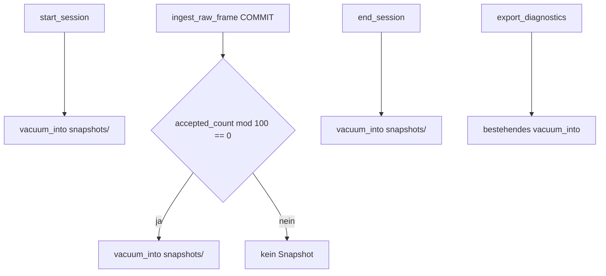

# Implementierungsplan: Hybrid-VACUUM-INTO-Snapshots

Priorität 2 aus der [Roadmap](../roadmap.md).  
Ziel: WAL-sichere DB-Snapshots bei Session-Grenzen und nach N akzeptierten Schüssen — **nie** per Dateikopie von `reddot.sqlite`.

Status: **Implemented** (2026-07-23)

---

## Ausgangslage

| Baustein | Ist |
|---|---|
| `PRAGMA journal_mode=WAL; synchronous=NORMAL` | gesetzt in `apps/desktop/src-tauri/src/db/mod.rs` |
| `Database::vacuum_into` | vorhanden in `db/recovery.rs` (inkl. `wal_checkpoint(TRUNCATE)` davor) |
| Aufruf | nur Notfall-/Diagnose-Export in `commands/recovery.rs` |
| Autosave-Marker | `last_autosave_sequence` / `last_autosave_at` in Ingest-TX (kein File-Snapshot) |
| Session-Grenzen | `engine/session_lifecycle.rs` → `start_session` / `end_session` |

### Warum nicht Dateikopie?

Im WAL-Modus können committete Transaktionen noch im `.wal`-File liegen. Eine reine Kopie von `reddot.sqlite` ohne Checkpoint/VACUUM ist **nicht** transaktional konsistent. `VACUUM INTO` liefert einen konsistenten Snapshot, solange `synchronous` auf `NORMAL` oder `FULL` steht (hier: `NORMAL`).

---

## Entscheidung (fest)

1. **Mechanismus:** ausschließlich `VACUUM INTO` (bestehende `vacuum_into`-API wiederverwenden).
2. **Trigger (hybrid):**
   - Session-**Start** (nach erfolgreichem `db.start_session`, bevor/nach Worker-Start — siehe Timing unten)
   - Session-**Ende** (nach `end_session` + Training-Save, vor Return)
   - Alle **N = 100** akzeptierten Schüsse (`IngestOutcome::Accepted`), gezählt pro Session
3. **Kein** zeitbasierter Pflicht-Timer in v1 (Event-Count + Session-Grenzen reichen; Zeit optional später als Soft-Cap).
4. **Ort:** App-Data-Unterordner `snapshots/` (neben DB), Dateiname `session-{id}-seq-{sequence}-{unix_ms}.sqlite`.
5. **Retention:** behalte die letzten **K = 5** Snapshots **pro Session** plus den neuesten globalen „latest“-Snapshot; ältere löschen. Fehler beim Snapshot dürfen den Ingest **nicht** fail-closen (best-effort loggen).
6. **Hot Path:** `VACUUM INTO` **nicht** innerhalb der Ingest-Transaktion. Nach erfolgreichem COMMIT: Zähler prüfen → Snapshot asynchron oder außerhalb der TX auf dem Writer-Pfad (Engine/Poll-Thread nach Ingest), ohne zweite parallele Schreib-Connection zu eröffnen außer der bereits erlaubten Poll-DB-Connection.

---

## Architektur



### Timing Session-Start

- Snapshot **nach** DB-`start_session` (Session-Zeile + Autosave-Marker existieren), **bevor** der Poll-Worker intensiv schreibt.
- Bei Fehler: Session trotzdem starten; Snapshot-Fehler nur loggen.

### Timing N-Schuss

- Zähler: akzeptierte Schüsse der Session (`shots` count oder In-Memory auf Poll/Engine nach `Accepted`).
- Bevorzugt: nach Ingest auf dem Poll-Thread `if accepted_shot_count % 100 == 0 { db.vacuum_into(...) }` — gleiche Connection wie Poll-Writer (ADR 0002).
- `VACUUM INTO` kann kurz blockieren; akzeptabel alle 100 Schüsse, nicht bei jedem Schuss.

### Timing Session-Ende

- Nach `db.end_session` / Training-History-Save in `end_session`, Worker bereits gestoppt → `vacuum_into`.

---

## Konkrete Code-Änderungen

| Datei | Änderung |
|---|---|
| `db/recovery.rs` oder neues `db/snapshots.rs` | `snapshot_dir()`, `write_session_snapshot(session_id, sequence)`, Retention-Cleanup |
| `db/mod.rs` | Re-export / Modul verdrahten |
| `engine/session_lifecycle.rs` | Aufruf Start + Ende |
| `arena/ingest.rs` oder `engine/poll` | nach Accepted: Modulo-Trigger (außerhalb TX) |
| `commands/recovery.rs` | unverändert für Export; optional gleiche Staging-Helfer nutzen |
| `tests/arena_integrity.rs` | Test: nach N Accepted existiert Snapshot-Datei; Start/Ende erzeugen Datei; Dateikopie-Pfad bewusst **nicht** testen |
| `docs/adr/0004-wal-safe-snapshots.md` | ADR: VACUUM INTO, synchronous=NORMAL, Anti-Pattern Dateikopie |
| `docs/roadmap.md` | Status der Snapshot-Zeilen auf DONE setzen nach Merge |

Keine Schema-Migration nötig (reine Dateien unter App-Data), sofern kein Snapshot-Index in SQLite gewünscht. Optional später Tabelle `db_snapshots(path, session_id, sequence, created_at)` — **nicht** in v1.

---

## Konstanten

```text
SNAPSHOT_EVERY_N_SHOTS = 100
SNAPSHOT_RETAIN_PER_SESSION = 5
SNAPSHOT_SUBDIR = "snapshots"
```

Konfigurierbar später über Settings; v1 hart kodiert + kommentiert.

---

## Docs parallel

1. **ADR 0004** — WAL-sichere Snapshots:
   - Entscheidung: `VACUUM INTO` + `synchronous=NORMAL`
   - Anti-Pattern: `copy reddot.sqlite` / nur `.sqlite` ohne WAL/Checkpoint
   - Hybrid-Trigger: Session-Grenzen + alle N Events/Schüsse
2. Kurzer Absatz in ADR 0002 oder Review: Snapshots laufen über denselben Writer, nicht aus dem Frontend.
3. Roadmap-Zeilen aktualisieren.

---

## Nicht Teil dieses Plans

- Erweiterung Notfall-ZIP um separate Rohframes-/Checksums-Dateien (Roadmap PARTIAL — eigene Aufgabe)
- Zeitintervall-Timer
- Phase-2 ResultSnapshot (fachliche Rangliste ≠ DB-File-Snapshot)
- Cloud-/Vereinsserver-Sync der Snapshot-Dateien

---

## Akzeptanzkriterien

- [x] Session-Start erzeugt eine `.sqlite` unter `snapshots/` via `VACUUM INTO`
- [x] Session-Ende erzeugt einen weiteren Snapshot
- [x] Nach 100 Accepted-Ingests existiert ein Zwischen-Snapshot
- [x] Kein Code-Pfad kopiert `reddot.sqlite` byteweise als Backup
- [x] Snapshot-Fehler lassen Ingest und Session-Lifecycle erfolgreich
- [x] ADR 0004; Roadmap-Zeilen Snapshot aktualisiert
- [x] Integrationstest deckt Start + N-Schuss ab
