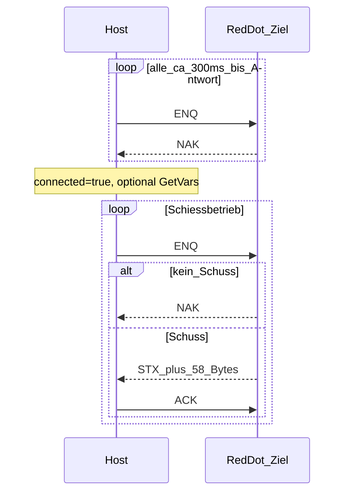

# DISAG RedDot — Serielles Protokoll

Geräteverhalten für Host ↔ Ziel. Herkunft/Validierungsstatus: [protocol/provenance.md](./protocol/provenance.md).

Unbekannte oder nicht gegen Live-Hardware bestätigte Punkte: **pending validation**.

## Link-Parameter

| Parameter | Wert | Status |
|---|---|---|
| Baudrate | 9600 | in Code / Captures-Workflow |
| Data bits | 8 | in Code |
| Parity | None | in Code |
| Stop bits | One | in Code |
| Read/Write timeout | 500 ms | **pending validation** |
| Transport | RS-232 oder Bluetooth-SPP (virtueller COM / RFCOMM) | Produkt: siehe [transport.md](./transport.md) |

## Steuerzeichen (ASCII)

| Name | Byte | Hex | Rolle |
|---|---|---|---|
| STX | 2 | `0x02` | Beginn Schuss-Frame (59 Bytes) |
| ENQ | 5 | `0x05` | Poll / Anfrage (Host → Ziel) |
| ACK | 6 | `0x06` | Bestätigung |
| DC1 | 17 | `0x11` | Kommando-Präfix |
| NAK | 21 | `0x15` | „kein Schuss“ / Keepalive-Antwort |
| ETB | 23 | `0x17` | definiert; Nutzung außerhalb Normalbetrieb **pending validation** |

## Verbindungsablauf (Host)



1. Port öffnen (9600 8N1 bzw. RFCOMM-Äquivalent).
2. Periodisch `ENQ` senden (typisch ~300 ms), solange keine laufende Kommando-Aktivität.
3. Erste sinnvolle Antwort (`NAK` oder `STX`) ⇒ Verbindung hergestellt; optional Firmware-Variablen lesen (`GetVars`).
4. Weiter `ENQ` pollen. Bei `NAK`: kein neuer Schuss. Bei `STX`: 59-Byte-Frame lesen, `ACK` senden, Frame parsen.
5. Während offener DC1-Kommandos kein ENQ.

Timing und Reconnect-Details gegen Hardware: **pending validation**. Captures: [captures/CHECKLIST.md](./captures/CHECKLIST.md).

## Schuss-Frame (59 Bytes)

Gesamtlänge ab `STX` inklusive: **59**. Unvollständige Frames werden verworfen.

| Offset | Länge | Inhalt | Parsing |
|---|---|---|---|
| 0 | 1 | `STX` (`0x02`) | Frame-Start |
| 1–31 | 31 | Header/Metadaten | **pending validation** |
| 32 | 4 | Ringwert als ASCII | `.` entfernen → `int`; Display = Wert / 10 |
| 37 | 6 | Distanz/Teiler als ASCII | `.` entfernen → `int`; Display = Wert / 10 |
| 44 | 5 | X als ASCII | `int` |
| 50 | 5 | Y als ASCII | `int` |
| 55–58 | 4 | Trailer | **pending validation** |

Anzeige-Semantik (Implementierung in Parsern):

- `valueRaw = 105` → Anzeige **10.5** (Zehntel); ohne Zehntelwertung `floor(10.5) = 10`
- `distanceRaw = 123` → Anzeige **12.3**; physische Einheit **pending validation**
- `x` / `y`: kartesische Trefferlage; Winkel in der UI aus `atan2` abgeleitet
- Zeitstempel kommt vom Host, nicht aus dem Frame

Nach Empfang: Host sendet **ACK**, ENQ-Poll wieder aktiv.

## DC1-Kommandos (Host → Ziel)

Frame: `[DC1][cmd_hi][cmd_lo]` mit Big-Endian-`uint16` Kommando-ID.

| Name | ID (dez) | ID (hex) | Bytes nach DC1 |
|---|---|---|---|
| getvars | 4020 | `0x0FB4` | `0F B4` |
| reset | 4022 | `0x0FB6` | `0F B6` |
| init | 4023 | `0x0FB7` | `0F B7` |
| disctype_old | 1 | `0x0001` | `00 01` |
| disctype_new | 4 | `0x0004` | `00 04` |

`init` und Folgen außerhalb des normalen Schießbetriebs: **pending validation** (nicht Teil des MVP-Hot-Paths).

### GetVars (Firmware-Info)

1. Sende `DC1 0F B4`.
2. Auf `ACK` warten.
3. Sende 2-Byte Variablen-Index (Big-Endian), z. B. `00 01` oder `00 02`.
4. Erwarte **4 Bytes**: `[addr_hi][addr_lo][val_hi][val_lo]`.
5. `val` → Application-Version (Param 1) bzw. Application-Revision (Param 2).

Live-Bestätigung: **pending validation**.

### Scheibenkennung / Disctype

Nach `DC1` + Disctype-Kommando und `ACK`: 1–2 Payload-Bytes (Typ, optional Wait). Live-Mapping: **pending validation**.

### Reset

Reset-Kommando existiert (`0x0FB6`). Antwort-/Folgeablauf außerhalb Normalbetrieb: **pending validation**.

## Abgeleitete Anzeigewerte

```
value_display    = valueRaw / 10        // ggf. Math.floor ohne Zehntel
distance_display = distanceRaw / 10
```

Weitere Ableitungen aus Distanz: **pending validation** (nicht im Hot-Path nötig).

## Reconnect (Software-Stand)

1. Host pollt mit ENQ (~300 ms), solange kein Schuss.
2. Erste sinnvolle Antwort (NAK oder STX) ⇒ verbunden.
3. Port-/Link-Verlust ⇒ Searching/Disconnected; erneutes Öffnen + ENQ-Loop.
4. Arena-Ingest ist idempotent (Sequenz/SHA) — doppelte Frames erhöhen den Schusszähler nicht.

Live-Verhalten (Timing, Resend, ACK vor erneutem ENQ): **pending validation**.

## Offene Punkte (Hardware)

- [ ] Bytes 1–31 und 55–58 mappen (`sniffer analyze` auf Live-Captures)
- [ ] Einheit von X/Y und Koordinaten-Ursprung
- [ ] Bestätigen, ob Bluetooth-SPP/RFCOMM identische Bytes liefert
- [ ] Captures: ENQ→NAK Idle, ENQ→STX Schuss, GetVars, Burst
- [ ] Reconnect unter Port-Drop dokumentieren

Vorbereitung: [captures/CHECKLIST.md](./captures/CHECKLIST.md) · [captures/live/](./captures/live/).

## Implementierung

- TypeScript: `packages/protocol/`
- Rust: `apps/desktop/src-tauri/src/protocol.rs`
- Transport: [transport.md](./transport.md)
