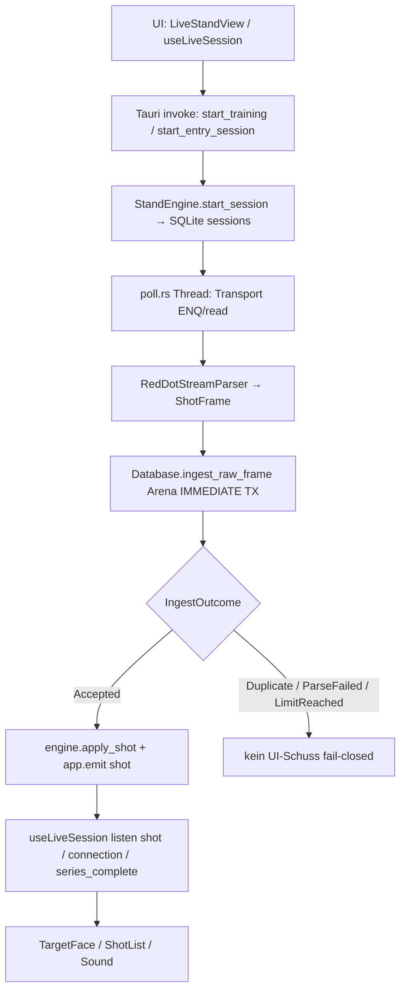

# RotPunktArena — Architektur- & Feature-Review

Stand: Codebasis `D:\RotPunktArena` (verifiziert gegen Repo) · lokaler Tauri-Stand-Client als Ersatz für RedDotView (Phase-1-MVP) · SQLite-Migrationen bis **v8** · **37** Tauri-Commands · **3** UI-Views (Live · Büro · Training).

> **Kurzurteil:** Die App ist ein lauffähiger lokaler Stand-Client. Schüsse laufen fail-closed über Arena-Ingest (Frame → Event → Projection → UI). Büro/Wettkampf inkl. Nachkauf, Mannschaften und Ergebnisse sind verdrahtet; Training speichert Serien automatisch. Offen: Live-Validierung am Gerät, TCP-Transport, Serial nur hinter Cargo-Feature.

Verwandte Docs: [protocol.md](./protocol.md) · [transport.md](./transport.md) · [ADR 0001–0003](./adr/) · [captures/](./captures/)

---

## 1. Fortschritt / was gebaut wurde

| Bereich | Status | Was konkret |
|---|---|---|
| Serielles Protokoll | fertig (Live **pending validation**) | ENQ/NAK/STX/ACK, 59-Byte-Frame, Offsets Wert/Teiler/X/Y — `docs/protocol.md`, `packages/protocol`, Rust `protocol.rs`; Status: [protocol/provenance.md](./protocol/provenance.md) |
| Transport | Simulator + Serial-Flag | Simulator default; Serial hinter `--features serial`; `TransportKind::Tcp` nur vorbereitet (Phase T) |
| Tauri Desktop | MVP | `apps/desktop` — React/Vite UI + Rust `StandEngine` + SQLite `reddot.sqlite` (App-Data) |
| Arena Integrity | fertig | Atomic ingest, SHA-/Sequenz-Dedupe, fail-closed UI; Tests `src-tauri/tests/arena_integrity.rs`; ADRs 0001–0003 |
| Live-Stand | fertig | Training & Wettkampf, Scheibe, Punkte/Teiler, Session-Lifecycle, Serie-Limit, Sim-Schüsse |
| Büro | fertig | Personen, Wettkämpfe, Startliste, Status, Clone, Ergebnisse + Detail/Druck |
| Nachkauf | fertig | Migration v7; Checkbox „Nachkauf erlaubt“; nach `done` volle neue Serie; Ranking = beste Serie; Limit = `max_shots` pro Session |
| Mannschaften | fertig | Migration v8; `db/teams.rs`; Commands + Büro-UI (Drag-Drop, Teamwertung) |
| Training-Historie | fertig | `training_saved`-Flag (v5); `person_id` (v6); Auto-Save beim Beenden; Trend-Chart; Filter |
| UI-Polish / Sound | fertig | `BrandLogo`, Score-Tick, Web-Audio-Schussklang + Mute (`localStorage`), Schussbild-Druck |
| Hardware-Live | offen | Protokoll laut Docs noch nicht gegen Live-Hardware validiert; Captures synthetisch |

---

## 2. Wie Features umgesetzt sind

### 2.1 Protokoll & Parser

| Schicht | Pfad | Rolle |
|---|---|---|
| TypeScript | `packages/protocol/src/index.ts` | `parseShotFrame`, ENQ/ACK/DC1-Encode, Konstanten (9600 8N1, 59-Byte-Frame); Selftest `selftest.ts` |
| Rust | `apps/desktop/src-tauri/src/protocol.rs` | `RedDotStreamParser`, `build_synthetic_shot_frame`, `aim_coords_to_ascii`, `stamp_frame_nonce` |
| Docs / Protokoll | `docs/protocol.md`, `docs/protocol/provenance.md`, `docs/captures/` | Spezifikation + Validierungsstatus + Hex-Fixtures |

- `PARSER_VERSION = "reddot-stx-v1"` (Arena Core).
- Header-Bytes `[1..31]` und Trailer `[55..58]` sind bis zu einem Live-Capture unbekannt.

### 2.2 Arena Core (Shot Integrity)

- Einstieg: `Database::ingest_raw_frame` in `apps/desktop/src-tauri/src/arena/mod.rs`.
- In **einer** SQLite-Transaktion: Frame speichern → Dedupe (`device_sequence` oder SHA-256) → parse → Limit-Check → Event `shot_received` → Projection `shots` → `sessions.next_sequence++` → COMMIT.
- UI/Emit nur bei `IngestOutcome::Accepted` (fail-closed). Weitere Outcomes: `Duplicate`, `ParseFailed`, `LimitReached`.
- Tabellen `frames`, `events` (mit `sequence`), `shots` — eingeführt/umgeschrieben in Migration **v3**.
- Integrationstests: `apps/desktop/src-tauri/tests/arena_integrity.rs`.
- Architekturentscheidungen: [ADR 0001](./adr/0001-shot-integrity.md), [0002](./adr/0002-single-writer.md), [0003](./adr/0003-events-vs-projections.md).

### 2.3 StandEngine & Poll-Worker

| Modul | Pfad | Rolle |
|---|---|---|
| Engine | `engine/mod.rs` | In-Memory-`LiveState`, Session start/end, `inject_synthetic_shot` / `fire_aim_shot`, `finish_series_if_needed` |
| Poll | `engine/poll.rs` | Eigener Thread + eigene DB-Connection: ENQ-Loop → Parser → ingest → emit `shot` / `connection` / `series_complete` |

Click-to-Shoot und Dev-Testschuss umgehen die Sim-Queue und rufen denselben Arena-Pfad (`inject_synthetic_shot`) auf dem Engine-Thread auf.

### 2.4 Büro / Wettkampf

| Schicht | Dateien |
|---|---|
| DB | `db/people.rs`, `db/competitions.rs`, `db/results.rs`, `db/teams.rs` |
| Commands | `commands/bureau.rs` (Personen, Competitions, Entries, Nachkauf, Teams, Results) |
| UI | `BureauView.tsx`, `useBureauData.ts`, `EntryResultPanel.tsx` |

- Start-Guard: `assert_entry_can_start` — offene Session blockiert; Status `done` ohne Nachkauf blockiert; mit `nachkauf_enabled` nach `done` erneuter Start (volle Serie) erlaubt.
- Wettbewerb-Status: `draft` / `active` / `closed`.

### 2.5 Nachkauf & Schuss-Limit

- Schema **v7** (Spalten unverändert): `competitions.nachkauf_enabled` / `nachkauf_shots` (Legacy, Create speichert 0), `competition_entries.nachkauf_purchased` (= **Zähler gestarteter Nachkauf-Serien**, nicht Extra-Schüsse).
- Modell: Nach `done` beliebig oft eine **volle neue Serie** (`max_shots`) starten, wenn `nachkauf_enabled`. Jede Session = eine Serie; Serie 1 = Hauptrunde, jede weitere = Nachkauf.
- Limit pro Session: `effective_max_shots` = `max_shots` (kein `max + purchased` mehr). Erzwungen in Arena (`session_effective_max_shots` → `LimitReached`) und vorab in der Engine.
- Ranking: **beste Serie** je Entry (Ringe: höchste Summe; Teiler: beste/niedrigste Serie). Detail/Druck: alle Serien via `list_entry_series` / `series[]`, beste markiert (`isBest`).
- Integritätstest: `competition_nachkauf_full_series_best_of` in `arena_integrity.rs`.
- Bei Erreichen des Limits: `finish_series_if_needed` → Session zu, Entry `done`, Event `series_complete`.

### 2.6 Mannschaften

- Schema **v8**: `team_scoring_enabled`, `team_count`, Tabellen `competition_teams` / `competition_team_members`.
- DB-API: `db/teams.rs` (angelegt, listen, Mitglieder, `list_team_results` — beste N Schützen laut `team_count`).
- Commands in `lib.rs`: `set_competition_team_settings`, `list_teams`, `create_team`, `rename_team`, `remove_team`, `add_team_member`, `remove_team_member`, `list_team_results`.
- Büro-UI: Teamwertung aktivieren, Teams anlegen, Starter per Drag-and-Drop zuweisen, Teamwertung in der Ergebnisübersicht.
- Hinweis: `rename_team` ist als Command vorhanden; die Büro-UI nutzt aktuell Anlegen/Entfernen/Mitglieder, kein separates Umbenennen-Feld.

### 2.7 Training-Historie

- DB: `db/training.rs` — Flag `training_saved` (Migration **v5**), `sessions.person_id` (**v6**).
- Commands: `commands/training.rs` (`save_training_session`, `list_training_history`, `list_training_shooters`, `reset_training_series`).
- Auto-Save in `StandEngine::end_session`, wenn Training (kein `competition_id`) und Schussanzahl > 0.
- UI: `TrainingHistoryView.tsx`, `TrainingTrendChart.tsx`.

### 2.8 SQLite-Migrationen (v1–v8)

Definiert in `apps/desktop/src-tauri/src/db/migrate.rs`:

| Version | Name | Inhalt |
|---|---|---|
| 1 | `baseline_sessions_events_settings` | `sessions`, `events`, `settings` |
| 2 | `people_competitions` | `people`, `competitions`, `competition_entries` |
| 3 | `shot_integrity_frames_events_shots` | Rewrite: `frames`, Events mit `sequence`, `shots`, `next_sequence` |
| 4 | `ensure_sessions_competition_columns` | Session-Spalten für Wettkampf-Link |
| 5 | `training_saved_flag` | Training-Historie-Flag |
| 6 | `sessions_person_id` | Schütze als Person-FK |
| 7 | `competition_nachkauf` | Nachkauf-Spalten |
| 8 | `competition_teams` | Teamwertung-Schema |

Laufzeit-Tabelle: `schema_migrations`. DB-Datei: App-Data `reddot.sqlite` (WAL, `busy_timeout`, Foreign Keys).

### 2.9 Tauri-Commands (Überblick)

Registriert in `apps/desktop/src-tauri/src/lib.rs` (37 Stück):

- **Live:** `get_live_state`, `start_training`, `start_entry_session`, `end_training`, `queue_sim_shot`, `fire_aim_shot`, `set_auto_fire`, `list_serial_ports`, `auto_detect_port`, `reset_training_series`
- **Büro:** Personen, Competitions, Entries, Nachkauf, Results, Teams (siehe oben)
- **Training:** `save_training_session`, `list_training_history`, `list_training_shooters`
- **Dev:** `dev_diagnostics`, `dev_inject_test_shot`

Frontend-Wrapper: `apps/desktop/src/api/commands.ts`.

---

## 3. Was die UI kann

Navigation in `App.tsx`: **Live** · **Büro** · **Training**.

| Oberfläche | Fähigkeiten |
|---|---|
| Live-Stand | Training oder Wettkampf wählen; Simulator starten / COM verbinden (wenn `serial`-Feature); Session beenden; Nächster Schütze; Serie zurücksetzen (Training); Punkte/Teiler; Scheibenbeschriftung; Schussliste; Schussbild drucken; Ton/Stumm; bei Nachkauf nach `done` „Nachkauf starten“ (neue volle Serie) |
| Live · Schießen | Hardware/Sim über Poll-Worker; „Schuss senden“ und Auto-Schuss (Sim); Maus-Aim nur mit offenem Dev-Panel |
| Büro | Personen anlegen; Wettkampf (Disziplin, `max_shots`, Ringe/Teiler, Nachkauf-Checkbox, Teamwertung); Status draft/active/closed; Startliste add/remove/reorder/clone; Entry-Status; Teams + Drag-Drop; Ergebnisübersicht (Best-of) + Detail/Druck aller Serien |
| Training | Gespeicherte Serien, Filter Alle/Schütze, Trend Punkte oder Teiler |
| Dev-Panel | Diagnostik (Schema, Frames, Events, unclean Sessions); Testschuss → DB; Toggle Maus-Schießen |

Komponenten u. a.: `TargetFace`, `ShotList`, `BrandLogo`, `ShooterAutocomplete`, `DevPanel`, `EntryResultPanel`, `printShotCard`, `useShotSound`, `useLiveSession`, `useBureauData`.

---

## 4. Verdrahtung / Datenfluss

### Hot Path (Hardware / Simulator)



### Click-to-Shoot / Dev (ohne Poll-Queue)

```text
fire_aim_shot / queue_sim_shot / dev_inject_test_shot
  → StandEngine.inject_synthetic_shot
  → build_synthetic_shot_frame + stamp_frame_nonce
  → dieselbe ingest_raw_frame-Pipeline
  → emit("shot") + finish_series_if_needed
```

### Büro-Pfad

```text
UI → api/commands.ts → Tauri commands/bureau.rs
  → engine.with_db(|db| …) → SQLite
```

React schreibt nicht direkt in SQLite (Single Writer, [ADR 0002](./adr/0002-single-writer.md)).

### Domain-Typen

`packages/domain/src/index.ts` — `LiveState`, `UiShot`, `Competition`, `Entry`, Teams, Training, Results; camelCase = Rust `serde(rename_all = "camelCase")`.

**Hinweis:** TS-`EventKind` (`session_started` / `shot` / …) hinkt den Arena-Kinds hinterher (`shot_received`, `frame_parse_error`, …). Die Live-UI speist sich aus In-Memory-Snapshot + Tauri-Events, nicht aus dem rohen Event-Log-Enum.

---

## 5. Repo-Aufbau

| Pfad | Inhalt |
|---|---|
| `apps/desktop` | Tauri 2 + React/Vite Stand-Client (Hauptprodukt) |
| `apps/desktop/src` | Views, Hooks, Components, `api/commands.ts` |
| `apps/desktop/src-tauri/src` | `lib.rs`, `arena/`, `engine/`, `protocol.rs`, `transport/`, `db/*`, `commands/*` |
| `apps/desktop/src-tauri/tests` | Arena-Integritätstests |
| `packages/protocol` | TS-Parser (Serielles Protokoll; auch Sniffer) |
| `packages/domain` | Geteilte Domain-Typen Stand ↔ später Server |
| `tools/sniffer` | CLI Replay/COM-Sniff auf `@rotpunktarena/protocol` |
| `docs/` | Protokoll, Transport, ADRs, Captures, diese Review; Provenance: `docs/protocol/provenance.md` |

npm workspaces (Root `package.json`): `desktop:dev` / `desktop:build`, `protocol:test`.

---

## 6. Architekturentscheidungen (ADRs)

Unter `docs/adr/` (Welle A, Accepted):

| ADR | Titel | Kern |
|---|---|---|
| [0001](./adr/0001-shot-integrity.md) | Shot Integrity | Raw-Frame vor UI; eine IMMEDIATE-TX; Emit nur nach `Accepted` |
| [0002](./adr/0002-single-writer.md) | Single Writer | Nur Rust schreibt SQLite; Poll-Worker mit eigener Connection; kein sync Listen→Lock |
| [0003](./adr/0003-events-vs-projections.md) | Events vs Projections | `frames` Evidenz, `events` Log, `shots` Projection; Büro-Entities ≠ Event-Log |

---

## 7. Offen / teilweise

| Thema | Lage |
|---|---|
| Hardware-Validierung | Offsets Header/Trailer, Baud/Live-Verhalten — Captures noch synthetisch (`docs/captures/synthetic-shot.hex`); Workflow in `docs/captures/README.md` |
| TcpTransport | `TransportKind::Tcp` + Docs Phase T — Implementierung fehlt |
| Serial default | Nur mit Cargo-Feature `serial`; sonst Hinweis in der UI (`serialFeature`) |
| Domain `EventKind` | TS-Typen hinter Rust-Event-Kinds |
| Team umbenennen | Command `rename_team` vorhanden, Büro-UI ohne Rename-Feld |
| Vereinsserver / Multi-Stand | Out of scope Phase 1; Domain-Paket vorbereitet |

---

## 8. Schnellstart

```bash
cd "D:\RotPunktArena"
npm install
npm run desktop:dev
```

Ohne Hardware: **Simulator starten** → Verbindungsstatus → Schüsse senden / Auto-Schuss.

Serial-Build:

```bash
cd apps/desktop/src-tauri
cargo build --features serial
```

Siehe Root-`README.md` und `apps/desktop/README.md`.
